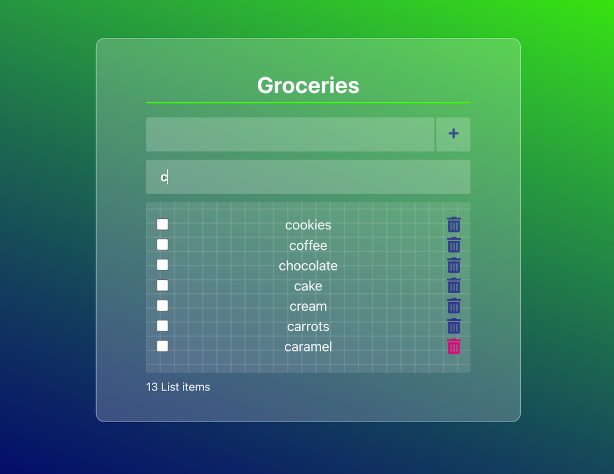

# Grocery List App
App with search tool and web storage functionality written in React. The app allows users to add items to their shopping list, remove items from the shopping list, search for items on the list, and save their list to local storage so it persists between sessions.


## Installation

1. Clone the repository:
   ```bash
   git clone https://github.com/tpreisig/react-grocery-list.git
   ```
2. Navigate to the project directory:
   ```bash
   cd react-grocery-list
   ```
3. Install dependencies:
   ```bash
   npm install
   ```

## Usage

To start the app, run:
```bash
npm start
```
Open [http://localhost:3000](http://localhost:3000) to view it in your browser.

## Get familiar

A good way to get familiar with React is to start by checking out the [React documentation](https://reactjs.org/) 🧑🏼‍💻.

## License

This project is licensed under the MIT License - see the [LICENSE](LICENSE) file for details.

## Screenshots



## Contact

Maintained by tpreisig - feel free to reach out!
